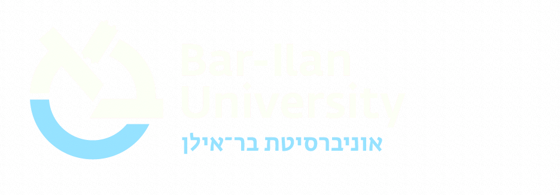

# BIU Web Brand System

A practical reference for building websites that share the visual identity of
the AI for Research master class site. Copy what you need, ignore what you
don't. Everything below is implemented in [`assets/site.css`](assets/site.css)
and [`assets/site.js`](assets/site.js) — treat those as the canonical source;
this document is the why and the when.

A blank template that wires everything up lives at
[`brand-starter.html`](brand-starter.html). Duplicate it to start a new page.

---

## Principles

1. **Editorial, not corporate.** Instrument Serif italic for display, generous
   whitespace, no stock imagery, no colorful icon packs.
2. **Subtle motion earns attention.** Scroll reveal, accent lines, progress
   bar. Nothing pulses, spins, or demands focus.
3. **One anchor, one accent.** Deep green (`#00493d`) carries the brand;
   sky-blue (`#78CDE6`) is reserved for interactive affordances only.
4. **Bilingual lockup, monolingual body.** Hebrew name beside the logo; page
   content is English unless the audience is Hebrew-first.
5. **Respect attention.** Cards animate in once, never again. No sticky banners,
   no autoplay, no cookie traps.

---

## Tokens

### Colors

| Token          | Hex       | Role                                       |
|----------------|-----------|--------------------------------------------|
| `--green`      | `#00493d` | Primary — anchor, headings, CTA base       |
| `--green-dark` | `#002e1a` | Header gradient end                        |
| `--green-med`  | `#007a4a` | Button gradient mid-stop                   |
| `--mint`       | `#eef6e6` | Title-bar / footer surface                 |
| `--bg`         | `#f5faf0` | Page background (warm cream)               |
| `--card`       | `#ffffff` | Card surface                               |
| `--border`     | `#d4e4c8` | Card borders, dividers                     |
| `--text`       | `#1a1a1a` | Body text (never pure black)               |
| `--muted`      | `#4a6040` | Secondary text, captions                   |
| `--blue`       | `#78CDE6` | Accent — focus rings, progress, hover line |
| `--blue-dark`  | `#0e5f7a` | Secondary-accent text                      |

Rules:
- **Green is the identity.** Never substitute.
- **Sky-blue is interactive-only**: focus rings, scroll progress, hover accent
  lines, small highlights in the header badge. Do not use it for headings or
  static decorations.
- **Backgrounds stay warm.** Cream or white. Never neutral gray.
- **Avoid pure black.** Use `--text`.

### Typography

- **Display**: `'Instrument Serif', Georgia, serif`, italic, for `h1` and the
  occasional pull-quote. Size 34–44px.
- **Body / UI**: `'Inter', -apple-system, sans-serif`. Weights 400, 500, 600, 700.

Import:
```html
<link rel="preconnect" href="https://fonts.googleapis.com">
<link rel="preconnect" href="https://fonts.gstatic.com" crossorigin>
<link href="https://fonts.googleapis.com/css2?family=Inter:wght@400;500;600;700&family=Instrument+Serif:ital@0;1&display=swap" rel="stylesheet">
```

Scale (body baseline 16–17px):

| Role           | Size    | Weight | Notes                              |
|----------------|---------|--------|------------------------------------|
| Display h1     | 38px    | 400    | Italic, Instrument Serif           |
| h2             | 20px    | 600    | Inter                              |
| Eyebrow / tag  | 10–13px | 700    | UPPERCASE, 0.06–0.12em tracking    |
| Body           | 16–17px | 400    | Line-height 1.6–1.65               |
| Caption / why  | 13–15px | 400    | `--muted` color                    |

### Space, radii, elevation

- Container: `max-width: 1100px; width: 92%; margin: 0 auto;`
- Card radius: **12px** inside, **16px** on outer page frames (header/footer).
- Section padding: `32px 36px` desktop, `24px 20px` mobile.
- Resting shadow: usually none. Use borders to define cards.
- Hover elevation: `0 10px 36px -16px rgba(0, 73, 61, 0.22)`.
- Big CTA hover: `0 20px 44px -18px rgba(0, 73, 61, 0.55)`.

### Motion

- Easing token: `cubic-bezier(0.2, 0.8, 0.2, 1)` (`--ease-out`).
- Reveal: 600–620ms, 14px translate-Y.
- Hover lift: 160–220ms.
- Accent-line draw: 320ms.
- Everything behind `@media (prefers-reduced-motion: reduce)`.

---

## Components

### BIU header (every page)

```html
<div class="biu-header">
  <div class="left-side">
    <div>
      <div class="badge">AI INITIATIVES</div>
      <div class="date">Month Year</div>
    </div>
  </div>
  <div class="right-side">
    
  </div>
</div>
```

- Background is the signature `linear-gradient(135deg, #00493d, #002e1a)`.
- `biu-lockup.png` is the official lockup (microscope icon + bilingual
  wordmark) on a transparent background. Default height 48px; scale to
  64px in oversized landing-page headers. Never stretch, recolor, or
  substitute with the icon alone unless space is critical.
- Badge pill is sky-blue on dark green.

### Title bar

Cream surface, sky-blue 3px bottom border, centered serif `h1`. Short lede
beneath. Caps the page's "identity stripe" (header + nav + title-bar).

### Back-to-home nav

A white strip with a border, `← Back to ...` text. Reacts on hover: sky-blue
gradient sweeps left-to-right, text pulls slightly leftward, green deepens.
Include on every page except the landing.

### Section / card

```html
<div class="section">
  <div class="section-header">
    <div class="section-num">1</div>
    <div>
      <h2>Title</h2>
      <div class="why">One-line purpose or subtitle.</div>
    </div>
  </div>
  <!-- content -->
</div>
```

On hover the shared stylesheet draws a 3px green-to-blue line down the left
edge and softens the shadow. Do not nest sections.

### Buttons

Primary CTA (forms, generators):

```html
<button class="btn btn-primary">Generate Context Brief</button>
```

Download (PDFs, docs):

```html
<a class="download-btn" href="file.pdf" download>
  <svg viewBox="0 0 24 24" fill="none" stroke="currentColor" stroke-width="2.5"
       stroke-linecap="round" stroke-linejoin="round">
    <path d="M21 15v4a2 2 0 0 1-2 2H5a2 2 0 0 1-2-2v-4"/>
    <polyline points="7 10 12 15 17 10"/>
    <line x1="12" y1="15" x2="12" y2="3"/>
  </svg>
  Download Workshop Packet
</a>
```

Both lift on hover; the download arrow does a one-shot bounce.

### Tags (category pills)

Four utility styles for categorising cards:

| Class              | Use               | Palette                |
|--------------------|-------------------|------------------------|
| `.tag-interactive` | Interactive tools | Green on mint          |
| `.tag-guide`       | Reference prose   | Sky-blue on pale cyan  |
| `.tag-reference`   | Static docs       | Amber on pale yellow   |
| `.tag-demo`        | Examples          | Violet on pale violet  |

One pill per card. If you need a fifth tag, question whether the category
really belongs.

### Iconography

**Rule: no emoji, no flat full-color icons, no illustrations.**

Use inline line SVGs with these attributes:

```html
<svg viewBox="0 0 24 24" fill="none" stroke="currentColor"
     stroke-width="1.5" stroke-linecap="round" stroke-linejoin="round"
     aria-hidden="true">...</svg>
```

- Size with CSS (`width`/`height`), never inline attributes.
- Color inherits from the parent via `currentColor` — usually `--green`.
- Style is _abstract geometry_, not figurative. Prefer rectangles, circles,
  simple paths.
- The library established in `index.html` covers: form-with-lines, layered
  cards, shield + check, ruled document, download arrow, eye (for examples).
  Reuse before extending.

### Info boxes, hints, callouts

Light-colored rectangles with a 1px border matching the tint:
- Neutral hint → sky-blue light (`#eef8fc`) on sky-blue border.
- Warning → amber light (`#fffbeb`) on amber border.
- Success → mint (`#edf7e8`) on green border.

Use sparingly. Two per page is already a lot.

---

## Page shell

Every page follows this order. Any deviation should be deliberate.

```
1. BIU header          ← identity
2. Back-to-home nav    ← orientation (skip on landing)
3. Title bar           ← what this page is
4. Body sections       ← the content
5. Footer              ← credit + links
```

Wrap everything in `<div class="container">` with `max-width: 1100px`.

---

## Motion system

All provided by [`assets/site.js`](assets/site.js), activated by including
the shared stylesheet + script. You get, for free:

- **Scroll reveal** on every card class listed in `REVEAL_SELECTORS`. Elements
  fade up 14px over ~620ms when they enter the viewport. Fires once per element.
- **Top progress bar** — 3px green-to-blue gradient fixed at `top: 0`, tracks
  scroll position on every page.
- **Hover accent line** on content cards. Adds a 3px green-to-blue bar that
  draws from top to bottom on the card's left edge.
- **Focus rings** on every focusable element, in sky-blue.
- **Back-nav sweep** and **download-button bounce** (see Components).

To adopt on a new page, add to `<head>`:

```html
<script>document.documentElement.classList.add("js");</script>
<link rel="stylesheet" href="assets/site.css">
<script src="assets/site.js" defer></script>
```

The inline script prevents flash-of-invisible-content by setting `html.js`
before the CSSOM paints.

---

## Accessibility

- **Focus-visible**: 3px sky-blue ring (`rgba(120, 205, 230, 0.6)`) at 2px
  offset. Never remove.
- **Reduced motion**: respected globally in `site.css`. Do not bypass.
- **Contrast**: body text and links meet WCAG AA on `--bg` and `--card`.
  If you introduce a new surface, meter it before shipping.
- **Decorative SVGs**: `aria-hidden="true"`.
- **Meaningful images**: real alt text. The BIU icon uses `alt="BIU"`.
- **Keyboard**: everything clickable must be reachable by Tab. No `div`s with
  `onclick`.

---

## Don'ts

- **No emoji as iconography.** Abstract line SVGs only.
- **No bright colors outside the token list.** Resist the urge to add a third
  accent. If something needs emphasis, use weight, size, or the sky-blue accent
  line — not a new hue.
- **No heavy shadows.** Keep blur radius under 20px. Elevation, not depth.
- **No dark mode yet.** The palette is designed for light backgrounds. If a
  dark variant is needed, it's its own design project.
- **No animated GIFs, no autoplay video, no sticky banners, no modals on
  landing.** Respect the reader.
- **No framework overhead.** This system is plain HTML + CSS + one tiny JS
  file. Keep it that way. If you reach for React or Tailwind, reconsider.

---

## Starting a new BIU site

1. Copy `brand-starter.html` as your first page.
2. Copy `assets/site.css` and `assets/site.js` into the new project's `assets/`.
3. Copy `biu-lockup.png` into the project root. (The icon-only variants
   `biu-icon-tight.png` / `biu-logo.png` are available if you need them,
   but the header uses the lockup.)
4. Edit the badge date, page title, and body sections. Leave the header,
   nav, and footer patterns intact.
5. Deploy to GitHub Pages (repository Settings → Pages → Source: `main` / root).
   Allow a minute for the first build.

When in doubt, match an existing page in this repo and diverge only with reason.
